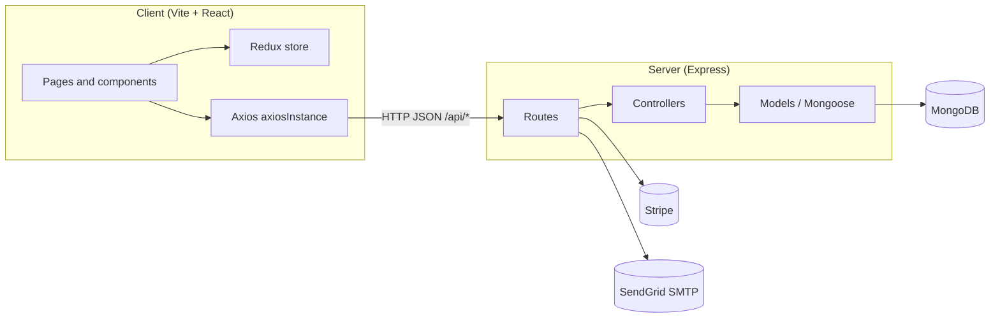
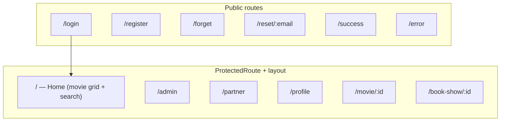
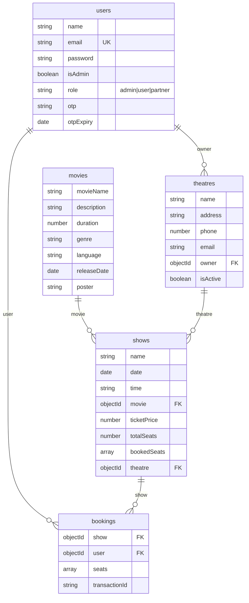
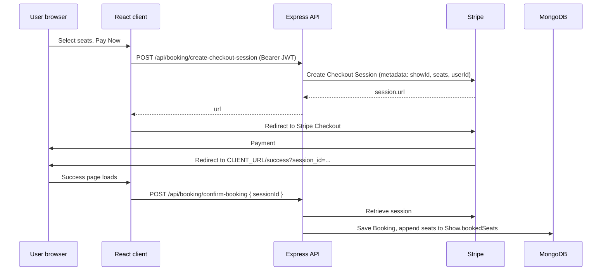
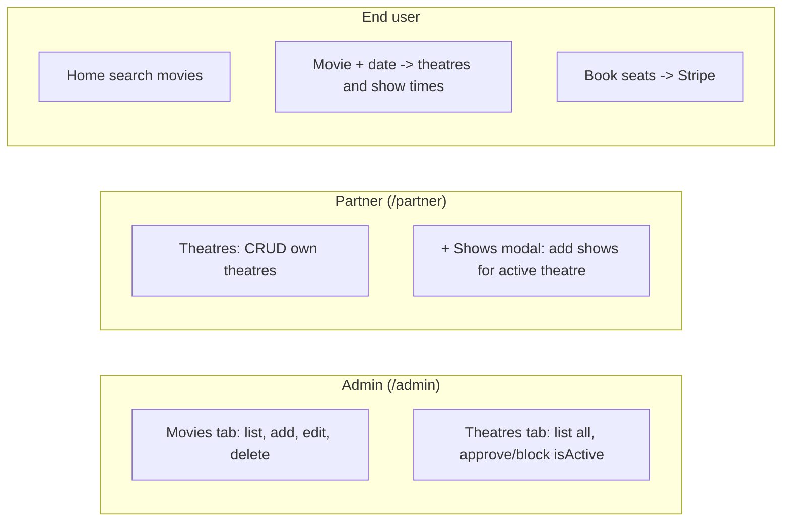
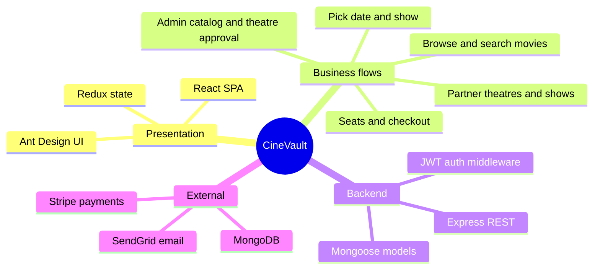

# CineVault — Architecture & Feature Overview

This document describes the **CineVault** codebase: architecture, roles, data model, APIs, main user flows, and technologies covered.

---

## 1. What this project is

A **full-stack movie ticketing demo**: users browse movies, pick a date, see which theatres run that movie, book seats, and pay via **Stripe Checkout**. **Admins** manage the movie catalog and approve/block theatres. **Partners** own theatres, manage theatre details, and schedule **shows** (screenings). Authentication uses **JWT** in `localStorage`; the shell UI uses **Ant Design** layout/menus and **Redux** for user and loading state.

---

## 2. Repository layout (two apps)

| Area | Stack | Role |
|------|--------|------|
| `client/` | React 19, Vite 6, React Router 7, Redux Toolkit, Ant Design, Tailwind 4, Axios, Stripe.js | SPA; talks to API (via Vite proxy to port 3001) |
| `server/` | Express 5, Mongoose 8, JWT, Stripe server SDK, Nodemailer (SendGrid SMTP) | REST API on **port 3001**; **MongoDB** via `DB_URL` |

---

## 3. Frontend routes and who sees what

From `App.jsx`, most app pages are wrapped in **`ProtectedRoute`**, which requires `localStorage.token`, calls **`GET /api/users/get-current-user`**, and stores the user in Redux. **Login, Register, Forgot/Reset password, Success, and Error** are public.

**Role-based navigation** (not enforced server-side for every route): the user menu’s “My Profile” sends **admin** → `/admin`, **partner** → `/partner`, else → `/profile`.

---

## 4. Backend API surface

Mounted in `server.js`:

| Prefix | Purpose |
|--------|---------|
| `/api/users` | Register, login, get current user (auth), forgot/reset password |
| `/api/movies` | CRUD-style movie operations + get by id |
| `/api/theatres` | Theatre CRUD, list all (admin), list by owner (partner) |
| `/api/shows` | Show CRUD; shows by theatre; **theatres-by-movie** for a given date; get show by id |
| `/api/booking` | Stripe Checkout session (auth), confirm booking from session, legacy `book-show`, list bookings |

---

## 5. Data model (MongoDB / Mongoose)

Conceptual relationships:

**Important behaviors**

- **Shows** store **`bookedSeats`** as an array of seat numbers; availability is derived from `totalSeats` vs length of `bookedSeats` on the client.
- **Theatres** have **`isActive`**: admin can approve/block; partners only get “+ Shows” when active.
- **Users** have **`role`** plus legacy **`isAdmin`** on the schema.

---

## 6. End-to-end booking flow (Stripe)

Path used by `BookShow.jsx` and `SuccessPage.jsx`:

**Topics covered:** Stripe Checkout, payment success redirect, server-side session retrieval, persisting booking and seat updates after payment.

---

## 7. Admin vs partner features

- **Admin**: catalog (**movies**) and **governance** of theatres (`isActive`).
- **Partner**: **theatres** tied to `owner` id from Redux user, and **shows** (movie, date, time, price, seats) for approved theatres.

---

## 8. Authentication and security topics

| Topic | How it appears in the project |
|--------|-------------------------------|
| **JWT** | Issued on login; sent as `Authorization: Bearer <token>`; middleware sets `req.userId` |
| **Protected UI** | Token + `/get-current-user` before rendering children |
| **Password reset** | OTP stored on user, emailed via **Nodemailer + HTML templates**, reset clears OTP |
| **Env config** | `dotenv` on server; `DB_URL`, `JWT_SECRET` / `jwt_secret`, `STRIPE_SECRET_KEY`, `CLIENT_URL`, `SENDGRID_API_KEY` |

**Implementation notes**

- Login issues a token if the email exists but **does not verify the password** against the stored value in the current controller code.
- **`bcryptjs`** is listed in `server/package.json` but is **not used** in the user controller for hashing or comparison.
- The auth middleware verifies tokens with **`JWT_SECRET`** while login signs with **`process.env.jwt_secret`** — environment variable names must align for auth to work.

---

## 9. Frontend architecture topics

| Topic | Usage |
|--------|--------|
| **React Router** | Declarative routes; query `?date=` on movie page |
| **Redux Toolkit** | `user` slice, `loader` slice for global spinners |
| **Ant Design** | Layout, Menu, Table, Form, Card, Result, etc. |
| **Tailwind** | Utility classes on booking/seat map and success page |
| **Axios instance** | Default JSON headers; authorization header is set when the module loads from `localStorage` |
| **Moment** | Date formatting and show-time sorting |

---

## 10. Integrations

- **Stripe**: server creates Checkout Sessions; client uses **`@stripe/stripe-js`** with a publishable key (see `BookShow.jsx`).
- **Email**: `emailHelper` reads **`server/utils/email_templates/*.html`**, substitutes `#{placeholders}`, sends via **SendGrid SMTP**.

---

## 11. Domain features checklist

| Feature | Covered? |
|---------|----------|
| User registration / login | Yes |
| Role concept (admin / partner / user) | Yes (model + menu routing) |
| Movie catalog CRUD | Yes (admin UI + API) |
| Theatre lifecycle + admin approval | Yes (`isActive`) |
| Show scheduling per theatre | Yes |
| Discover shows by movie + date | Yes (`get-all-theatres-by-movie`) |
| Seat selection UI | Yes (fixed 120-seat grid in UI; `totalSeats` on show is displayed but grid is hardcoded) |
| Paid booking | Yes (Stripe + confirm-booking) |
| Email on password reset | Yes |
| Ticket email after `book-show` | Intended in booking routes (separate path from Stripe flow) |

---

## 12. Codebase consistency notes

When extending the app, watch for field-name alignment between UI and Mongoose (e.g. **`movieName`** vs **`title`**, **`releaseDate`** vs **`date`** on movie detail views). The **`GET /api/booking/get-all-bookings`** handler uses `req.body.userId` while middleware sets **`req.userId`** — adjust if you rely on that endpoint.

---

## 13. Summary: features → layers

---

*Generated for the CineVault project repository. Mermaid diagrams render in GitHub, many IDEs, and documentation tools that support Mermaid.*
